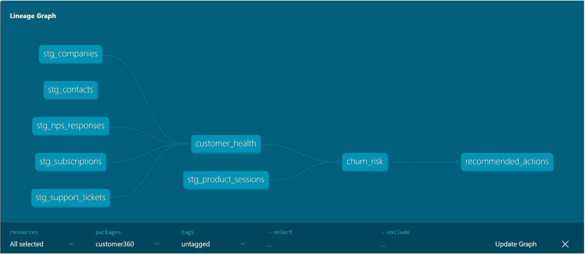
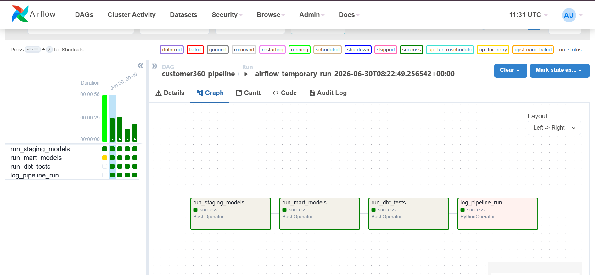
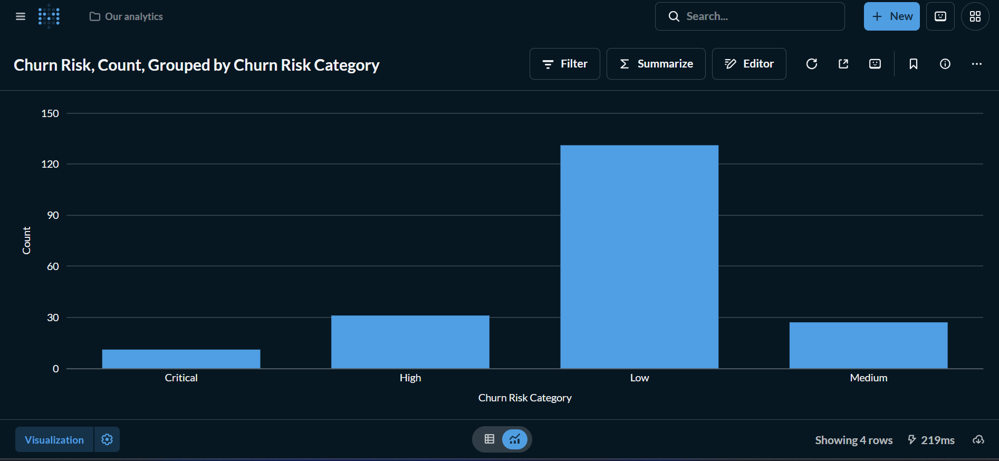
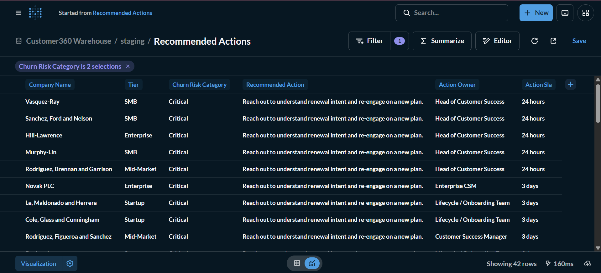

# Customer360 Intelligence Platform

An end-to-end analytics platform that brings together CRM, billing, support, product usage, marketing, and customer feedback data into a single customer view. It helps Customer Success teams understand account health, identify customers at risk of churn, and prioritize the right follow-up actions.

---

## Why I Built This Project

Customer data rarely lives in one place. Sales teams work in a CRM, Finance manages subscriptions and invoices, Support handles customer issues, Product teams track feature adoption, and Marketing monitors engagement. Because these systems operate independently, it can be difficult to answer simple business questions such as:

- Which customers are most at risk of leaving?
- Why is a customer's health declining?
- Which accounts need attention today?
- Who should follow up, and what should they do?

I built this project to simulate how a modern data team would centralize operational data in a warehouse, transform it into reliable business models, and deliver insights that Customer Success teams can use every day.

---

## Screenshots

**dbt lineage graph** — staging models flowing into customer_health, churn_risk, and recommended_actions.



**Airflow DAG** — the full pipeline running end to end: staging → marts → tests → audit log.



**Churn risk distribution** — built in Metabase directly on top of the churn_risk mart.



**Recommended actions** — a focused view of Critical and High risk accounts, with tier-aware ownership and SLAs.



---

## Architecture

```text
CRM │ Billing │ Support │ Product Usage │ Marketing │ Surveys
                              │
                              ▼
                  PostgreSQL (Raw Layer)
                              │
                              ▼
                     dbt Staging Models
                              │
                              ▼
                      dbt Mart Models
       (customer_health • churn_risk • recommended_actions)
                              │
                ┌─────────────┴─────────────┐
                ▼                           ▼
        Metabase Dashboards          Apache Airflow
                                      Daily Orchestration
```

The pipeline follows a simple ELT architecture:

- **Raw layer** stores source data exactly as it is generated.
- **Staging models** clean, standardize, and validate each source.
- **Mart models** combine multiple sources into analytics-ready tables.
- **Metabase** provides dashboards for reporting and exploration.
- **Airflow** orchestrates the pipeline on a daily schedule.

---

## Technology Stack

| Technology | Purpose |
|------------|---------|
| Python | Generates realistic source-system data |
| PostgreSQL | Stores raw and transformed customer data |
| dbt Core | Builds, tests, and documents warehouse models |
| Apache Airflow | Schedules and orchestrates the pipeline |
| Docker Compose | Creates a reproducible development environment |
| Metabase | Visualizes customer metrics and business insights |
| Git & GitHub | Version control and collaboration |

---

## What the Platform Does

### Simulates Operational Data

Generates realistic business data across multiple operational systems, including:

- CRM
- Contacts
- Subscriptions
- Invoices
- Support tickets
- Product usage
- Feature adoption
- Marketing campaigns
- Email engagement
- NPS survey responses

This allows the entire analytics pipeline to be developed and tested without relying on production data.

### Calculates Customer Health

Builds a customer health score for every account using signals such as:

- Subscription status
- Product adoption
- Support history
- Customer satisfaction
- Net Promoter Score (NPS)

The result is a single score that helps Customer Success teams quickly identify accounts that may require attention.

### Identifies Churn Risk

Evaluates behavioural and operational signals including:

- Login inactivity
- Product usage trends
- Outstanding critical support tickets
- Subscription status
- Customer sentiment

Each account is classified into one of four categories:

- Low
- Medium
- High
- Critical

### Recommends Follow-up Actions

Instead of giving every high-risk customer the same recommendation, the platform considers **why** an account is at risk.

For example:

- A customer who hasn't logged in for 30 days receives a different recommendation from one that is actively using the product but has several unresolved critical support tickets.
- Enterprise accounts are assigned different owners and response times than Startup accounts.
- Healthy customers can be identified as good candidates for expansion opportunities or customer referrals.

Each recommendation includes:

- Recommended action
- Action owner
- Response time (SLA)
- Priority

---

## Business Questions This Project Answers

- Which customers are most likely to churn, and why?
- Which accounts need immediate attention?
- Who should follow up with each account?
- Are unresolved support issues affecting customer health?
- Which customers are actively adopting the product?
- Which accounts are good candidates for expansion or referrals?
- How does customer satisfaction (NPS) relate to retention risk?

---

## Example Output

| Company | Tier | Health | Risk | Recommended Action |
|---------|------|-------:|------|--------------------|
| Reese and Sons | Enterprise | 34 | Critical | Contact the customer sponsor within one business day to discuss renewal concerns and review recent account activity. |
| Beck, Harvey and Davis | Mid-Market | 46 | Critical | Schedule a retention call to understand declining engagement and agree on next steps. |
| Dean-Jimenez | Startup | 58 | High | Resolve outstanding support issues before discussing renewal. |
| Harris Group | Enterprise | 92 | Low | Discuss additional product capabilities that align with the customer's current usage. |

---

## Getting Started

### Start the Environment

```bash
docker compose up -d
```

### Generate Sample Data

```bash
python scripts/generate_data.py
```

### Build the Warehouse

```bash
docker exec -it c360_dbt bash -c "cd /usr/app/dbt/customer360 && dbt run"
```

### Access the Services

| Service | URL |
|---------|-----|
| Airflow | http://localhost:8080 *(admin / admin)* |
| Metabase | http://localhost:3000 |
| PostgreSQL | localhost:5432 *(postgres / customer360)* |

To trigger the full pipeline from Airflow:

```bash
docker exec -it c360_airflow_webserver airflow dags trigger customer360_pipeline
```

---

## Project Structure

```text
customer360-intelligence-platform/
├── datasets/                 Source data by domain
├── docs/                     Architecture and documentation
├── infrastructure/           Docker and PostgreSQL setup
├── ingestion/
│   └── dags/                 Airflow workflows
├── marts/
│   └── customer360/          dbt project
├── scripts/                  Data generation utilities
├── tests/                    Data quality tests
├── docker-compose.yml
└── README.md
```

---

## Data Model

### Raw Layer

Stores each simulated source system exactly as it is generated.

### Staging Layer

Creates one cleaned and standardized model for each source, including:

- `stg_companies`
- `stg_contacts`
- `stg_subscriptions`
- `stg_support_tickets`
- `stg_product_sessions`
- `stg_nps_responses`

### Business Marts

| Model | Description |
|-------|-------------|
| `customer_health` | Calculates customer health scores |
| `churn_risk` | Classifies customer churn risk |
| `recommended_actions` | Suggests follow-up actions, ownership, response times, and priority |

### Audit Layer

Stores pipeline execution history and row counts so every pipeline run is traceable.

---

## Current Status

✅ Docker environment

✅ PostgreSQL warehouse

✅ Realistic sample data generation

✅ dbt staging and mart models

✅ Airflow orchestration

✅ Customer health scoring

✅ Churn risk classification

✅ Recommended actions

### Planned Improvements

- Automated dbt data quality tests
- CI/CD with GitHub Actions
- Pipeline monitoring and alerting
- Cloud deployment
- Incremental dbt models

---

## License

This project is licensed under the MIT License. See the [LICENSE](LICENSE) file for details.